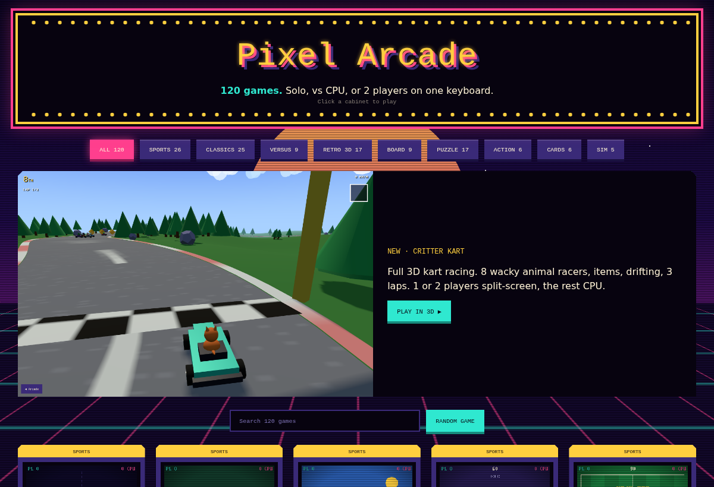
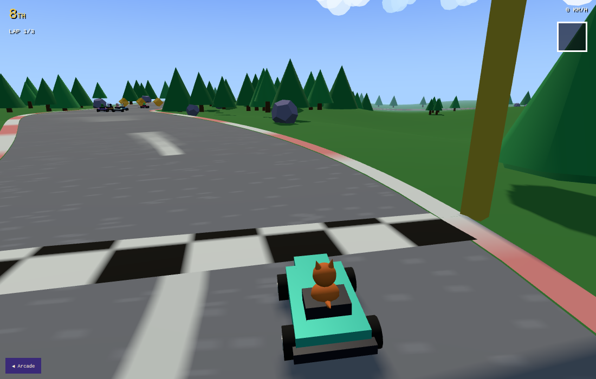
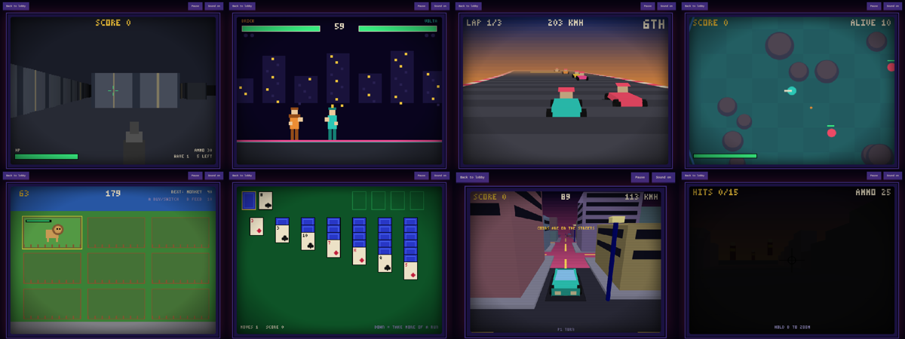

# Pixel Arcade

**120 original games in one static site.** A first-person shooter, a fighting game with its own roster, a zoo, card tables, sports, arcade classics, duels, polygon 3D, board games, puzzles and sims, all on a 320x240 pixel canvas with no build step, no server and no dependencies. Hosted on GitHub Pages.

[](https://normansrule.github.io/pixel-arcade/)

## Critter Kart (full 3D)

[](https://normansrule.github.io/pixel-arcade/kart/)

**Play: [normansrule.github.io/pixel-arcade/kart/](https://normansrule.github.io/pixel-arcade/kart/)**

A proper WebGL kart racer built on Three.js (vendored, no CDN): eight original animal racers with different speed, acceleration and weight, a hilly Catmull-Rom circuit with kerbs, textured asphalt, trees, rocks and a start arch, real-time shadows, fog and a sky shader. Items (boost, homing acorns, banana-style peel, shield, star), drift-boosting, kart-to-kart shoving, rubber-banded CPU with three skill levels, 1 or 2 local players in split-screen (keyboard or gamepads), and a results screen. Lives in `kart/` as its own page so the retro engine stays untouched.

**Play: [https://normansrule.github.io/pixel-arcade/](https://normansrule.github.io/pixel-arcade/)**



Every game is original code with its own name and art. Some are written in the style of well-known arcade genres, but none use the names, characters, mazes or assets of commercial games.

## Highlights

- 33 games play **vs CPU** with Easy / Normal / Hard levels, or **2 players** on one keyboard. Board games use real search (minimax, alpha-beta); sports opponents track and predict the ball.
- **Action:** Strike Zone 3D (FPS), Neon Fighters (4 original fighters with specials), Last Bot Standing (battle royale), Zombie Night, Dungeon Brawl, Tower Line.
- **Cards:** Blackjack, Video Poker, Klondike, Crazy Eights, Hi-Lo, Card Clash. **Sims:** Pixel Zoo, Safari Snap, Pocket Pet, Farm Plot, Reef Keeper.
- Every solo game has a **2 players take turns** mode and saves a best score in the browser.
- 17 **Retro 3D** cabinets plus a raycast first-person shooter and a sniper range use a built-in flat-shaded polygon renderer: chase cameras, hills, tunnels, a driveable city.
- One-line instructions on every title screen; Space starts. Nothing to read, just play.
- Lobby with category filters, search, a random-game button, live thumbnails and a synthwave/CRT look. Works on phones with an on-screen pad.
- Deep links: `#<game-id>` opens a game directly (every link below).

## Controls

| | Move | A | B |
|---|---|---|---|
| One player | Arrows or WASD | Space (also Z, F, Enter) | X (also G, Shift) |
| Two players, P1 | WASD | F | G |
| Two players, P2 | Arrows | Enter | Right Shift |

P pauses, M mutes, Esc returns to the lobby.

## All 120 games

### Action (6)

| Game | Modes | Play |
|---|---|---|
| Dungeon Brawl | solo / 2P take turns | [play](https://normansrule.github.io/pixel-arcade/#brawl) |
| Last Bot Standing | solo / 2P take turns | [play](https://normansrule.github.io/pixel-arcade/#royale) |
| Neon Fighters | vs CPU (3 levels) / 2P | [play](https://normansrule.github.io/pixel-arcade/#fighters) |
| Strike Zone 3D | solo / 2P take turns | [play](https://normansrule.github.io/pixel-arcade/#fps) |
| Tower Line | solo / 2P take turns | [play](https://normansrule.github.io/pixel-arcade/#towers) |
| Zombie Night | solo / 2P take turns | [play](https://normansrule.github.io/pixel-arcade/#zombies) |

### Sports (26)

| Game | Modes | Play |
|---|---|---|
| 100M Dash | vs CPU (3 levels) / 2P | [play](https://normansrule.github.io/pixel-arcade/#dash100) |
| Air Hockey | vs CPU (3 levels) / 2P | [play](https://normansrule.github.io/pixel-arcade/#airhockey) |
| Archery | solo / 2P take turns | [play](https://normansrule.github.io/pixel-arcade/#archery) |
| Badminton | vs CPU (3 levels) / 2P | [play](https://normansrule.github.io/pixel-arcade/#badminton) |
| Beach Volley | vs CPU (3 levels) / 2P | [play](https://normansrule.github.io/pixel-arcade/#volley) |
| Bowling 3D | vs CPU (3 levels) / 2P | [play](https://normansrule.github.io/pixel-arcade/#bowling) |
| Court Tennis | vs CPU (3 levels) / 2P | [play](https://normansrule.github.io/pixel-arcade/#tennis) |
| Curling | vs CPU (3 levels) / 2P | [play](https://normansrule.github.io/pixel-arcade/#curling) |
| Darts 301 | solo / 2P take turns | [play](https://normansrule.github.io/pixel-arcade/#darts) |
| Duck Gallery | solo / 2P take turns | [play](https://normansrule.github.io/pixel-arcade/#gallery) |
| Fishing Derby | solo / 2P take turns | [play](https://normansrule.github.io/pixel-arcade/#fishing) |
| Halfpipe | solo / 2P take turns | [play](https://normansrule.github.io/pixel-arcade/#halfpipe) |
| High Dive | solo / 2P take turns | [play](https://normansrule.github.io/pixel-arcade/#dive) |
| Home Run Derby | solo / 2P take turns | [play](https://normansrule.github.io/pixel-arcade/#homerun) |
| Hoops 1 On 1 | vs CPU (3 levels) / 2P | [play](https://normansrule.github.io/pixel-arcade/#hoops) |
| Hurdles | vs CPU (3 levels) / 2P | [play](https://normansrule.github.io/pixel-arcade/#hurdles) |
| Long Jump | solo / 2P take turns | [play](https://normansrule.github.io/pixel-arcade/#longjump) |
| Mini Golf | solo / 2P take turns | [play](https://normansrule.github.io/pixel-arcade/#golf) |
| Paddle Duel | vs CPU (3 levels) / 2P | [play](https://normansrule.github.io/pixel-arcade/#pong) |
| Penalty Kicks 3D | vs CPU (3 levels) / 2P | [play](https://normansrule.github.io/pixel-arcade/#penalty) |
| Pixel Soccer | vs CPU (3 levels) / 2P | [play](https://normansrule.github.io/pixel-arcade/#soccer) |
| Puck Hockey | vs CPU (3 levels) / 2P | [play](https://normansrule.github.io/pixel-arcade/#hockey) |
| Ring Boxing | vs CPU (3 levels) / 2P | [play](https://normansrule.github.io/pixel-arcade/#boxing) |
| Ski Slalom | solo / 2P take turns | [play](https://normansrule.github.io/pixel-arcade/#ski) |
| Swim Sprint | vs CPU (3 levels) / 2P | [play](https://normansrule.github.io/pixel-arcade/#swim) |
| Table Kick | vs CPU (3 levels) / 2P | [play](https://normansrule.github.io/pixel-arcade/#foos) |

### Retro 3D (17)

| Game | Modes | Play |
|---|---|---|
| Brick Breaker 3D | solo / 2P take turns | [play](https://normansrule.github.io/pixel-arcade/#bricks3d) |
| Canyon Run 3D | solo / 2P take turns | [play](https://normansrule.github.io/pixel-arcade/#canyon) |
| City Cruiser 3D | solo / 2P take turns | [play](https://normansrule.github.io/pixel-arcade/#city) |
| Cube Field 3D | solo / 2P take turns | [play](https://normansrule.github.io/pixel-arcade/#cubes) |
| Dungeon 3D | solo / 2P take turns | [play](https://normansrule.github.io/pixel-arcade/#dungeon) |
| Hover Tank 3D | solo / 2P take turns | [play](https://normansrule.github.io/pixel-arcade/#hover) |
| Kart Cup 3D | solo / 2P take turns | [play](https://normansrule.github.io/pixel-arcade/#kart) |
| Mesh Drift 3D | solo / 2P take turns | [play](https://normansrule.github.io/pixel-arcade/#drift) |
| Ring Race 3D | solo / 2P take turns | [play](https://normansrule.github.io/pixel-arcade/#rings) |
| Roller 3D | solo / 2P take turns | [play](https://normansrule.github.io/pixel-arcade/#roller) |
| Sky Ace 3D | solo / 2P take turns | [play](https://normansrule.github.io/pixel-arcade/#skyace) |
| Sniper Alley 3D | solo / 2P take turns | [play](https://normansrule.github.io/pixel-arcade/#sniper) |
| Star Run 3D | solo / 2P take turns | [play](https://normansrule.github.io/pixel-arcade/#starrun) |
| Trench Run 3D | solo / 2P take turns | [play](https://normansrule.github.io/pixel-arcade/#trench) |
| Tunnel Run 3D | solo / 2P take turns | [play](https://normansrule.github.io/pixel-arcade/#tunnel) |
| Turbo Road 3D | solo / 2P take turns | [play](https://normansrule.github.io/pixel-arcade/#road) |
| Wave Rider 3D | solo / 2P take turns | [play](https://normansrule.github.io/pixel-arcade/#waverider) |

### Classics (25)

| Game | Modes | Play |
|---|---|---|
| Astro Miner | solo / 2P take turns | [play](https://normansrule.github.io/pixel-arcade/#miner) |
| Block Drop | solo / 2P take turns | [play](https://normansrule.github.io/pixel-arcade/#blocks) |
| Brick Buster | solo / 2P take turns | [play](https://normansrule.github.io/pixel-arcade/#bricks) |
| Bubble Pop | solo / 2P take turns | [play](https://normansrule.github.io/pixel-arcade/#bubbles) |
| Byte Snake | solo / 2P take turns | [play](https://normansrule.github.io/pixel-arcade/#snake) |
| Cave Copter | solo / 2P take turns | [play](https://normansrule.github.io/pixel-arcade/#copter) |
| Cloud Hop | solo / 2P take turns | [play](https://normansrule.github.io/pixel-arcade/#cloudhop) |
| Cube Hop | solo / 2P take turns | [play](https://normansrule.github.io/pixel-arcade/#cubehop) |
| Dash Runner | solo / 2P take turns | [play](https://normansrule.github.io/pixel-arcade/#runner) |
| Flap Bot | solo / 2P take turns | [play](https://normansrule.github.io/pixel-arcade/#flap) |
| Galaxy Wave | solo / 2P take turns | [play](https://normansrule.github.io/pixel-arcade/#galaxy) |
| Girder Climb | solo / 2P take turns | [play](https://normansrule.github.io/pixel-arcade/#girder) |
| Invader Wave | solo / 2P take turns | [play](https://normansrule.github.io/pixel-arcade/#invaders) |
| Key Quest | solo / 2P take turns | [play](https://normansrule.github.io/pixel-arcade/#keyquest) |
| Millipede | solo / 2P take turns | [play](https://normansrule.github.io/pixel-arcade/#millipede) |
| Moon Lander | solo / 2P take turns | [play](https://normansrule.github.io/pixel-arcade/#lander) |
| Munch Maze | solo / 2P take turns | [play](https://normansrule.github.io/pixel-arcade/#munch) |
| Pinball | solo / 2P take turns | [play](https://normansrule.github.io/pixel-arcade/#pinball) |
| Road Hopper | solo / 2P take turns | [play](https://normansrule.github.io/pixel-arcade/#hopper) |
| Rock Blaster | solo / 2P take turns | [play](https://normansrule.github.io/pixel-arcade/#rocks) |
| Sky Fury | solo / 2P take turns | [play](https://normansrule.github.io/pixel-arcade/#skyfury) |
| Sky Shield | solo / 2P take turns | [play](https://normansrule.github.io/pixel-arcade/#shield) |
| Space Defender | solo / 2P take turns | [play](https://normansrule.github.io/pixel-arcade/#defender) |
| Tower Stack | solo / 2P take turns | [play](https://normansrule.github.io/pixel-arcade/#stack) |
| Tunnel Digger | solo / 2P take turns | [play](https://normansrule.github.io/pixel-arcade/#digger) |

### Versus (9)

| Game | Modes | Play |
|---|---|---|
| Arena Blast | vs CPU (3 levels) / 2P | [play](https://normansrule.github.io/pixel-arcade/#arena) |
| Blast Maze | vs CPU (3 levels) / 2P | [play](https://normansrule.github.io/pixel-arcade/#blast) |
| Laser Paint | vs CPU (3 levels) / 2P | [play](https://normansrule.github.io/pixel-arcade/#paint) |
| Neon Trails | vs CPU (3 levels) / 2P | [play](https://normansrule.github.io/pixel-arcade/#trails) |
| Quick Draw | vs CPU (3 levels) / 2P | [play](https://normansrule.github.io/pixel-arcade/#quickdraw) |
| Snake Duel | vs CPU (3 levels) / 2P | [play](https://normansrule.github.io/pixel-arcade/#snakeduel) |
| Sumo Bump | vs CPU (3 levels) / 2P | [play](https://normansrule.github.io/pixel-arcade/#sumo) |
| Tank Duel | vs CPU (3 levels) / 2P | [play](https://normansrule.github.io/pixel-arcade/#tanks) |
| Tug Of War | vs CPU (3 levels) / 2P | [play](https://normansrule.github.io/pixel-arcade/#tug) |

### Board (9)

| Game | Modes | Play |
|---|---|---|
| Checkers | vs CPU (3 levels) / 2P | [play](https://normansrule.github.io/pixel-arcade/#checkers) |
| Dots And Boxes | vs CPU (3 levels) / 2P | [play](https://normansrule.github.io/pixel-arcade/#dots) |
| Flip Disks | vs CPU (3 levels) / 2P | [play](https://normansrule.github.io/pixel-arcade/#flip) |
| Four In A Row | vs CPU (3 levels) / 2P | [play](https://normansrule.github.io/pixel-arcade/#four) |
| Gomoku | vs CPU (3 levels) / 2P | [play](https://normansrule.github.io/pixel-arcade/#gomoku) |
| Mancala | vs CPU (3 levels) / 2P | [play](https://normansrule.github.io/pixel-arcade/#mancala) |
| Memory Match | vs CPU (3 levels) / 2P | [play](https://normansrule.github.io/pixel-arcade/#memory) |
| Nim Sticks | vs CPU (3 levels) / 2P | [play](https://normansrule.github.io/pixel-arcade/#nim) |
| Tic Tac Toe | vs CPU (3 levels) / 2P | [play](https://normansrule.github.io/pixel-arcade/#ttt) |

### Cards (6)

| Game | Modes | Play |
|---|---|---|
| Blackjack | solo / 2P take turns | [play](https://normansrule.github.io/pixel-arcade/#blackjack) |
| Card Clash | vs CPU (3 levels) / 2P | [play](https://normansrule.github.io/pixel-arcade/#clash) |
| Crazy Eights | vs CPU (3 levels) / 2P | [play](https://normansrule.github.io/pixel-arcade/#eights) |
| Hi-lo | solo / 2P take turns | [play](https://normansrule.github.io/pixel-arcade/#hilo) |
| Klondike | solo / 2P take turns | [play](https://normansrule.github.io/pixel-arcade/#klondike) |
| Video Poker | solo / 2P take turns | [play](https://normansrule.github.io/pixel-arcade/#poker) |

### Puzzle (17)

| Game | Modes | Play |
|---|---|---|
| Block Fit | solo / 2P take turns | [play](https://normansrule.github.io/pixel-arcade/#blockfit) |
| Color Flood | solo / 2P take turns | [play](https://normansrule.github.io/pixel-arcade/#flood) |
| Crate Pusher | solo / 2P take turns | [play](https://normansrule.github.io/pixel-arcade/#crates) |
| Echo Pads | solo / 2P take turns | [play](https://normansrule.github.io/pixel-arcade/#echo) |
| Gem Swap | solo / 2P take turns | [play](https://normansrule.github.io/pixel-arcade/#gems) |
| Lights Out | solo / 2P take turns | [play](https://normansrule.github.io/pixel-arcade/#lights) |
| Maze Dash | solo / 2P take turns | [play](https://normansrule.github.io/pixel-arcade/#maze) |
| Mine Field | solo / 2P take turns | [play](https://normansrule.github.io/pixel-arcade/#mines) |
| Orbit Hop | solo / 2P take turns | [play](https://normansrule.github.io/pixel-arcade/#orbit) |
| Peg Jump | solo / 2P take turns | [play](https://normansrule.github.io/pixel-arcade/#pegs) |
| Pipe Flow | solo / 2P take turns | [play](https://normansrule.github.io/pixel-arcade/#pipes) |
| Power Tiles | solo / 2P take turns | [play](https://normansrule.github.io/pixel-arcade/#tiles) |
| Quick Math | solo / 2P take turns | [play](https://normansrule.github.io/pixel-arcade/#math) |
| Rhythm Tap | solo / 2P take turns | [play](https://normansrule.github.io/pixel-arcade/#rhythm) |
| Slide 15 | solo / 2P take turns | [play](https://normansrule.github.io/pixel-arcade/#slide) |
| Tower Of Hanoi | solo / 2P take turns | [play](https://normansrule.github.io/pixel-arcade/#hanoi) |
| Whack Bots | solo / 2P take turns | [play](https://normansrule.github.io/pixel-arcade/#whack) |

### Sim (5)

| Game | Modes | Play |
|---|---|---|
| Farm Plot | solo / 2P take turns | [play](https://normansrule.github.io/pixel-arcade/#farm) |
| Pixel Zoo | solo / 2P take turns | [play](https://normansrule.github.io/pixel-arcade/#zoo) |
| Pocket Pet | solo / 2P take turns | [play](https://normansrule.github.io/pixel-arcade/#pet) |
| Reef Keeper | solo / 2P take turns | [play](https://normansrule.github.io/pixel-arcade/#reef) |
| Safari Snap | solo / 2P take turns | [play](https://normansrule.github.io/pixel-arcade/#safari) |

## Run it yourself

```bash
git clone https://github.com/Normansrule/pixel-arcade.git
cd pixel-arcade
python3 -m http.server 8000     # open http://localhost:8000
```

Or fork it and enable Pages (Settings → Pages → Deploy from a branch → `main`, `/ (root)`).

## Add a game

Create a file in `games/`, add a `<script>` tag in `index.html`, register with `A.add`. The engine handles the lobby card, thumbnail, title screen, modes, pause, game over and best score.

```js
(function(){ const A = window.A, {W, H, K} = A;
A.add({
  id: 'catch', name: 'STAR CATCH', cat: 'CLASSICS',
  how: 'MOVE. CATCH THE STARS.',      // one line, keep it short
  // vs: 1,                          // CPU / 2 player game
  // low: 1,                         // lower score is better
  make(){
    const g = {over: null, score: 0};
    let x = 160, star = {x: 100, y: 0};
    g.update = () => {                 // 60 times a second
      const k = A.in(0);              // held keys: l r u d a b
      x += ((k.r ? 1 : 0) - (k.l ? 1 : 0)) * 3;
      star.y += 2;
      if (star.y > 220) {
        if (Math.abs(star.x - x) < 14) { g.score++; A.sfx('coin'); star = {x: A.rnd(W), y: 0}; }
        else g.over = 'GAME OVER';    // any string ends the game
      }
    };
    g.draw = () => { A.cls(); A.rect(x - 12, 222, 24, 6, K.c); A.circ(star.x, star.y, 3, K.y); A.text('SCORE ' + g.score, 6, 6, K.w, 2); };
    return g;
  }
});
})();
```

Engine API: `A.in(p)` / `A.hit(p)` for held / just-pressed keys; `A.cpu`, `A.two`, `A.lvl`, `A.ai` describe the chosen mode; `A.bot({l,r,u,d,a,b})` drives the CPU through the same input path as a human; `A.win(i)` / `A.nm(i)` for labels; 2D helpers `A.cls rect box circ ring line poly text hud2`; 3D helpers `A.cam`, `A.p3`, `A.face`, `A.box3`, `A.flush`.

## Test and bundle

- `node test.js` runs all 120 games headlessly in every mode with random input and checks for crashes, bad draw calls and puzzle solvability.
- `python3 build.py` writes `dist/pixel-arcade.html`, the entire retro arcade in a single file (Critter Kart is a separate page in `kart/`).

## Licence

MIT. See `LICENSE`.
