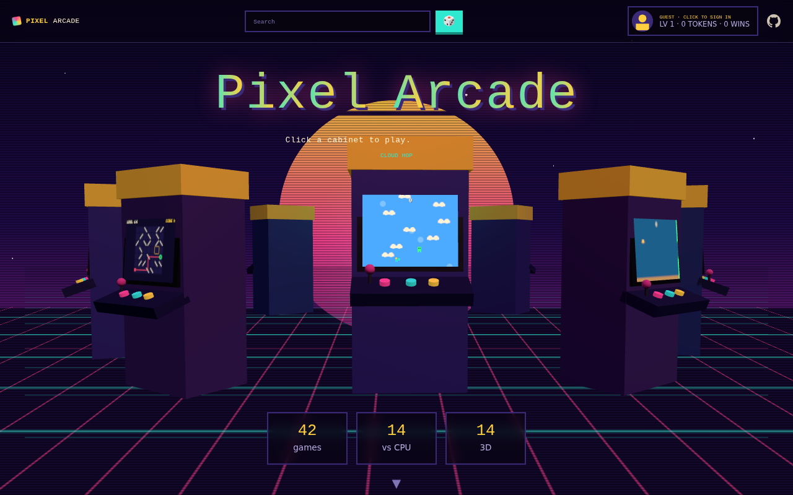
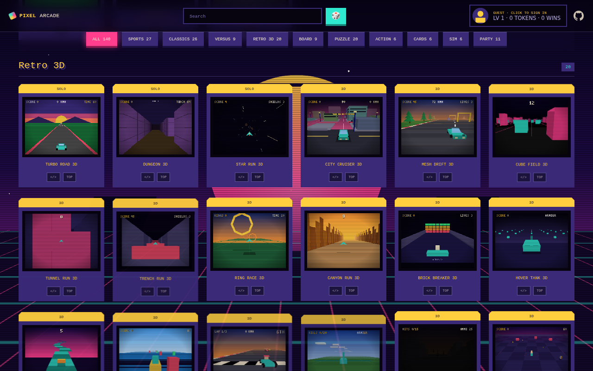

<div align="center">

# 🕹️ Pixel Arcade

**302 original games. One click to play.**

[](https://normansrule.github.io/pixel-arcade/)
[](https://github.com/Normansrule/pixel-arcade/actions/workflows/test.yml)


[](https://normansrule.github.io/pixel-arcade/)

</div>

## Play

**Click a cabinet.** That's it.

| | Keyboard | Mouse |
|---|---|---|
| Move | Arrows / WASD | aim games follow the pointer |
| A (fire, jump, select) | Space | click, hold, or spam |
| B | X | right-click |
| Exit · Pause · Mute | Esc · P · M | |
| 2 players | P1 WASD + F/G · P2 Arrows + Enter/Shift | |

## Highlights

- **Voxel Frontier**: block sandbox. Punch trees, craft (**E**) planks, sticks, torches and wood → stone → iron → diamond pickaxes; rock needs a pickaxe. Torches cast real flickering light. Sheep drop mutton (right click to eat). A 9-step goal chain guides new players.
- **Abyss Diver**: ocean survival. **R** sonar ping marks deposits and predators, **B** drops a beacon you can navigate back to, **Tab** opens the survey tablet, **Shift** runs the scooter on battery (recharge at the lifepod).
- **Hub**: star any cabinet to add it to **Favorites**; the **Recent** chip lists what you played last.

## Graphics

Full-3D cabinets (Voxel Frontier, Abyss Diver, Strike Zone, Night Drive, Critter Kart) share a cinematic post stack in [`js/fx3d.js`](js/fx3d.js): ACES filmic tone mapping, ground-truth ambient occlusion (GTAO), bloom, colour grade, and subpixel morphological anti-aliasing (SMAA). Press **G** in any of them to cycle quality (low · medium · ultra).

## Scores

Click the profile chip → enter your GitHub username. Game over → **U** posts your score (as a GitHub issue), **L** opens the global top 10.

## Games

<details><summary><b>Action</b> · 13</summary>

| Game | Mode | |
|---|---|---|
| [Boss Rush](https://normansrule.github.io/pixel-arcade/#bossrush) | solo | [src](games/action2.js) |
| [Chopper Rescue](https://normansrule.github.io/pixel-arcade/#chopper) | solo | [src](games/action2.js) |
| [Depth Charge](https://normansrule.github.io/pixel-arcade/#depth) | solo | [src](games/action2.js) |
| [Dungeon Brawl](https://normansrule.github.io/pixel-arcade/#brawl) | solo | [src](games/action.js) |
| [Last Bot Standing](https://normansrule.github.io/pixel-arcade/#royale) | solo | [src](games/action.js) |
| [Neon Fighters](https://normansrule.github.io/pixel-arcade/#fighters) | vs CPU · 2P | [src](games/action.js) |
| [Pet Brawl](https://normansrule.github.io/pixel-arcade/pets/) | auto-battler | [src](pets/game.js) |
| [Abyss Diver](https://normansrule.github.io/pixel-arcade/abyss/) | full 3D · ocean survival | [src](abyss/game.js) |
| [Night Drive](https://normansrule.github.io/pixel-arcade/drive/) | full 3D | [src](drive/game.js) |
| [Strike Zone](https://normansrule.github.io/pixel-arcade/strike/) | full 3D | [src](strike/game.js) |
| [Strike Zone 3D](https://normansrule.github.io/pixel-arcade/#fps) | solo | [src](games/action.js) |
| [Tower Line](https://normansrule.github.io/pixel-arcade/#towers) | solo | [src](games/action.js) |
| [Zombie Night](https://normansrule.github.io/pixel-arcade/#zombies) | solo | [src](games/action.js) |

</details>

<details><summary><b>Board</b> · 13</summary>

| Game | Mode | |
|---|---|---|
| [Checkers](https://normansrule.github.io/pixel-arcade/#checkers) | vs CPU · 2P | [src](games/versus2.js) |
| [Dice Poker](https://normansrule.github.io/pixel-arcade/#dicepoker) | vs CPU · 2P | [src](games/versus3.js) |
| [Dots And Boxes](https://normansrule.github.io/pixel-arcade/#dots) | vs CPU · 2P | [src](games/versus2.js) |
| [Flip Disks](https://normansrule.github.io/pixel-arcade/#flip) | vs CPU · 2P | [src](games/puzzle.js) |
| [Four In A Row](https://normansrule.github.io/pixel-arcade/#four) | vs CPU · 2P | [src](games/puzzle.js) |
| [Gomoku](https://normansrule.github.io/pixel-arcade/#gomoku) | vs CPU · 2P | [src](games/versus2.js) |
| [Hex Filler](https://normansrule.github.io/pixel-arcade/#filler) | vs CPU · 2P | [src](games/versus3.js) |
| [Mancala](https://normansrule.github.io/pixel-arcade/#mancala) | vs CPU · 2P | [src](games/versus2.js) |
| [Memory Match](https://normansrule.github.io/pixel-arcade/#memory) | vs CPU · 2P | [src](games/puzzle.js) |
| [Nim Sticks](https://normansrule.github.io/pixel-arcade/#nim) | vs CPU · 2P | [src](games/versus2.js) |
| [Pig Dice](https://normansrule.github.io/pixel-arcade/#pig) | vs CPU · 2P | [src](games/versus3.js) |
| [Sea Battle](https://normansrule.github.io/pixel-arcade/#battleship) | vs CPU · 2P | [src](games/versus3.js) |
| [Tic Tac Toe](https://normansrule.github.io/pixel-arcade/#ttt) | vs CPU · 2P | [src](games/puzzle.js) |

</details>

<details><summary><b>Cards</b> · 6</summary>

| Game | Mode | |
|---|---|---|
| [Blackjack](https://normansrule.github.io/pixel-arcade/#blackjack) | solo | [src](games/cards.js) |
| [Card Clash](https://normansrule.github.io/pixel-arcade/#clash) | vs CPU · 2P | [src](games/cards.js) |
| [Crazy Eights](https://normansrule.github.io/pixel-arcade/#eights) | vs CPU · 2P | [src](games/cards.js) |
| [Hi-lo](https://normansrule.github.io/pixel-arcade/#hilo) | solo | [src](games/cards.js) |
| [Klondike](https://normansrule.github.io/pixel-arcade/#klondike) | solo | [src](games/cards.js) |
| [Video Poker](https://normansrule.github.io/pixel-arcade/#poker) | solo | [src](games/cards.js) |

</details>

<details><summary><b>Classics</b> · 39</summary>

| Game | Mode | |
|---|---|---|
| [Astro Miner](https://normansrule.github.io/pixel-arcade/#miner) | solo | [src](games/classics3.js) |
| [Block Drop](https://normansrule.github.io/pixel-arcade/#blocks) | solo | [src](games/classics1.js) |
| [Brick Buster](https://normansrule.github.io/pixel-arcade/#bricks) | solo | [src](games/classics1.js) |
| [Bubble Pop](https://normansrule.github.io/pixel-arcade/#bubbles) | solo | [src](games/classics3.js) |
| [Byte Snake](https://normansrule.github.io/pixel-arcade/#snake) | solo | [src](games/classics1.js) |
| [Cave Copter](https://normansrule.github.io/pixel-arcade/#copter) | solo | [src](games/classics2.js) |
| [Cave Diver](https://normansrule.github.io/pixel-arcade/#cavediver) | solo | [src](games/action2.js) |
| [City Bomber](https://normansrule.github.io/pixel-arcade/#bomber) | solo | [src](games/action2.js) |
| [Cloud Hop](https://normansrule.github.io/pixel-arcade/#cloudhop) | solo | [src](games/solo.js) |
| [Cube Hop](https://normansrule.github.io/pixel-arcade/#cubehop) | solo | [src](games/classics3.js) |
| [Dash Runner](https://normansrule.github.io/pixel-arcade/#runner) | solo | [src](games/classics2.js) |
| [Flap Bot](https://normansrule.github.io/pixel-arcade/#flap) | solo | [src](games/classics2.js) |
| [Frost Peak](https://normansrule.github.io/pixel-arcade/#frost) | solo | [src](games/more.js) |
| [Galaxy Wave](https://normansrule.github.io/pixel-arcade/#galaxy) | solo | [src](games/classics3.js) |
| [Girder Climb](https://normansrule.github.io/pixel-arcade/#girder) | solo | [src](games/classics1.js) |
| [Helix Drop](https://normansrule.github.io/pixel-arcade/#helix) | solo | [src](games/arcade4.js) |
| [Invader Wave](https://normansrule.github.io/pixel-arcade/#invaders) | solo | [src](games/classics1.js) |
| [Key Quest](https://normansrule.github.io/pixel-arcade/#keyquest) | solo | [src](games/classics3.js) |
| [Kite Flyer](https://normansrule.github.io/pixel-arcade/#kite) | solo | [src](games/finale.js) |
| [Lane Dodge](https://normansrule.github.io/pixel-arcade/#lanes) | solo | [src](games/arcade4.js) |
| [Laser Dodge](https://normansrule.github.io/pixel-arcade/#laserdodge) | solo | [src](games/arcade4.js) |
| [Meteor Shower](https://normansrule.github.io/pixel-arcade/#meteors) | solo | [src](games/arcade4.js) |
| [Millipede](https://normansrule.github.io/pixel-arcade/#millipede) | solo | [src](games/classics3.js) |
| [Moon Lander](https://normansrule.github.io/pixel-arcade/#lander) | solo | [src](games/classics2.js) |
| [Munch Maze](https://normansrule.github.io/pixel-arcade/#munch) | solo | [src](games/classics1.js) |
| [Orbit Guard](https://normansrule.github.io/pixel-arcade/#orbitguard) | solo | [src](games/arcade4.js) |
| [Paper Plane](https://normansrule.github.io/pixel-arcade/#plane) | solo | [src](games/arcade4.js) |
| [Pinball](https://normansrule.github.io/pixel-arcade/#pinball) | solo | [src](games/solo.js) |
| [Planet Hop](https://normansrule.github.io/pixel-arcade/#planethop) | solo | [src](games/finale.js) |
| [Road Hopper](https://normansrule.github.io/pixel-arcade/#hopper) | solo | [src](games/classics2.js) |
| [Rock Blaster](https://normansrule.github.io/pixel-arcade/#rocks) | solo | [src](games/classics1.js) |
| [Rocket Landing](https://normansrule.github.io/pixel-arcade/#rocket) | solo | [src](games/finale.js) |
| [Sky Fury](https://normansrule.github.io/pixel-arcade/#skyfury) | solo | [src](games/solo.js) |
| [Sky Shield](https://normansrule.github.io/pixel-arcade/#shield) | solo | [src](games/classics2.js) |
| [Space Defender](https://normansrule.github.io/pixel-arcade/#defender) | solo | [src](games/classics3.js) |
| [Star Catcher](https://normansrule.github.io/pixel-arcade/#catcher) | solo | [src](games/arcade4.js) |
| [Tower Stack](https://normansrule.github.io/pixel-arcade/#stack) | solo | [src](games/solo.js) |
| [Tunnel Digger](https://normansrule.github.io/pixel-arcade/#digger) | solo | [src](games/classics3.js) |
| [Wall Jump](https://normansrule.github.io/pixel-arcade/#walljump) | solo | [src](games/action2.js) |

</details>

<details><summary><b>Party</b> · 11</summary>

| Game | Mode | |
|---|---|---|
| [Balloon Blitz](https://normansrule.github.io/pixel-arcade/#balloons) | vs CPU · 2P | [src](games/party.js) |
| [Basket Toss](https://normansrule.github.io/pixel-arcade/#toss) | vs CPU · 2P | [src](games/party.js) |
| [Bomb Pass](https://normansrule.github.io/pixel-arcade/#bombpass) | vs CPU · 2P | [src](games/party.js) |
| [Color Rush](https://normansrule.github.io/pixel-arcade/#colorrush) | vs CPU · 2P | [src](games/party.js) |
| [Dodgeball](https://normansrule.github.io/pixel-arcade/#dodgeball) | vs CPU · 2P | [src](games/party.js) |
| [Golf Duel](https://normansrule.github.io/pixel-arcade/#golfduel) | vs CPU · 2P | [src](games/party.js) |
| [Pool Shark](https://normansrule.github.io/pixel-arcade/#pool) | vs CPU · 2P | [src](games/party.js) |
| [Quad Pong](https://normansrule.github.io/pixel-arcade/#quadpong) | vs CPU · 2P | [src](games/party.js) |
| [Rhythm Duel](https://normansrule.github.io/pixel-arcade/#rhythmduel) | vs CPU · 2P | [src](games/party.js) |
| [Shuffleboard](https://normansrule.github.io/pixel-arcade/#shuffle) | vs CPU · 2P | [src](games/party.js) |
| [Turf Tag](https://normansrule.github.io/pixel-arcade/#tag) | vs CPU · 2P | [src](games/party.js) |

</details>

<details><summary><b>Puzzle</b> · 33</summary>

| Game | Mode | |
|---|---|---|
| [Balance](https://normansrule.github.io/pixel-arcade/#balance) | solo | [src](games/puzzle3.js) |
| [Block Fit](https://normansrule.github.io/pixel-arcade/#blockfit) | solo | [src](games/puzzle2.js) |
| [Chain Reaction](https://normansrule.github.io/pixel-arcade/#chain) | solo | [src](games/arcade4.js) |
| [Color Flood](https://normansrule.github.io/pixel-arcade/#flood) | solo | [src](games/puzzle2.js) |
| [Color Wheel](https://normansrule.github.io/pixel-arcade/#colorwheel) | solo | [src](games/arcade4.js) |
| [Crate Pusher](https://normansrule.github.io/pixel-arcade/#crates) | solo | [src](games/puzzle.js) |
| [Echo Pads](https://normansrule.github.io/pixel-arcade/#echo) | solo | [src](games/puzzle.js) |
| [Gem Swap](https://normansrule.github.io/pixel-arcade/#gems) | solo | [src](games/puzzle2.js) |
| [Ice Slide](https://normansrule.github.io/pixel-arcade/#iceslide) | solo | [src](games/puzzle3.js) |
| [Laser Maze](https://normansrule.github.io/pixel-arcade/#lasermaze) | solo | [src](games/more.js) |
| [Lights Out](https://normansrule.github.io/pixel-arcade/#lights) | solo | [src](games/puzzle.js) |
| [Maze Dash](https://normansrule.github.io/pixel-arcade/#maze) | solo | [src](games/puzzle2.js) |
| [Memory Grid](https://normansrule.github.io/pixel-arcade/#memgrid) | solo | [src](games/puzzle3.js) |
| [Merge Three](https://normansrule.github.io/pixel-arcade/#merge3) | solo | [src](games/puzzle3.js) |
| [Mine Field](https://normansrule.github.io/pixel-arcade/#mines) | solo | [src](games/puzzle.js) |
| [Nonogram](https://normansrule.github.io/pixel-arcade/#nonogram) | solo | [src](games/more.js) |
| [Orbit Hop](https://normansrule.github.io/pixel-arcade/#orbit) | solo | [src](games/solo.js) |
| [Parking Jam](https://normansrule.github.io/pixel-arcade/#parking) | solo | [src](games/puzzle3.js) |
| [Peg Jump](https://normansrule.github.io/pixel-arcade/#pegs) | solo | [src](games/puzzle2.js) |
| [Pipe Flow](https://normansrule.github.io/pixel-arcade/#pipes) | solo | [src](games/puzzle2.js) |
| [Power Tiles](https://normansrule.github.io/pixel-arcade/#tiles) | solo | [src](games/puzzle.js) |
| [Quick Math](https://normansrule.github.io/pixel-arcade/#math) | solo | [src](games/puzzle2.js) |
| [Rhythm Tap](https://normansrule.github.io/pixel-arcade/#rhythm) | solo | [src](games/solo.js) |
| [Slide 15](https://normansrule.github.io/pixel-arcade/#slide) | solo | [src](games/solo.js) |
| [Sudoku 6](https://normansrule.github.io/pixel-arcade/#sudoku6) | solo | [src](games/puzzle3.js) |
| [Sum Ten](https://normansrule.github.io/pixel-arcade/#sumten) | solo | [src](games/puzzle3.js) |
| [Sushi Stack](https://normansrule.github.io/pixel-arcade/#sushi) | solo | [src](games/more.js) |
| [Tile Pairs](https://normansrule.github.io/pixel-arcade/#tilepairs) | solo | [src](games/puzzle3.js) |
| [Tile Twist](https://normansrule.github.io/pixel-arcade/#twist) | solo | [src](games/puzzle3.js) |
| [Timing Bar](https://normansrule.github.io/pixel-arcade/#timing) | solo | [src](games/arcade4.js) |
| [Tower Of Hanoi](https://normansrule.github.io/pixel-arcade/#hanoi) | solo | [src](games/puzzle2.js) |
| [Water Sort](https://normansrule.github.io/pixel-arcade/#watersort) | solo | [src](games/puzzle3.js) |
| [Whack Bots](https://normansrule.github.io/pixel-arcade/#whack) | solo | [src](games/solo.js) |

</details>

<details><summary><b>Retro 3D</b> · 24</summary>

| Game | Mode | |
|---|---|---|
| [Voxel Frontier](https://normansrule.github.io/pixel-arcade/voxel/) | full 3D · block sandbox | [src](voxel/game.js) |
| [Brick Breaker 3D](https://normansrule.github.io/pixel-arcade/#bricks3d) | solo | [src](games/threed3.js) |
| [Canyon Run 3D](https://normansrule.github.io/pixel-arcade/#canyon) | solo | [src](games/threed3.js) |
| [City Cruiser 3D](https://normansrule.github.io/pixel-arcade/#city) | solo | [src](games/threed2.js) |
| [Coin Dash 3D](https://normansrule.github.io/pixel-arcade/#coindash) | solo | [src](games/more.js) |
| [Crossy 3D](https://normansrule.github.io/pixel-arcade/#crossy3d) | solo | [src](games/finale.js) |
| [Cube Field 3D](https://normansrule.github.io/pixel-arcade/#cubes) | solo | [src](games/threed2.js) |
| [Dungeon 3D](https://normansrule.github.io/pixel-arcade/#dungeon) | solo | [src](games/threed.js) |
| [Hover Tank 3D](https://normansrule.github.io/pixel-arcade/#hover) | solo | [src](games/threed3.js) |
| [Kart Cup 3D](https://normansrule.github.io/pixel-arcade/#kart) | solo | [src](games/threed4.js) |
| [Mesh Drift 3D](https://normansrule.github.io/pixel-arcade/#drift) | solo | [src](games/threed2.js) |
| [Rail Blaster 3D](https://normansrule.github.io/pixel-arcade/#rail) | solo | [src](games/more.js) |
| [Ring Race 3D](https://normansrule.github.io/pixel-arcade/#rings) | solo | [src](games/threed3.js) |
| [Roller 3D](https://normansrule.github.io/pixel-arcade/#roller) | solo | [src](games/threed3.js) |
| [Sky Ace 3D](https://normansrule.github.io/pixel-arcade/#skyace) | solo | [src](games/threed4.js) |
| [Sniper Alley 3D](https://normansrule.github.io/pixel-arcade/#sniper) | solo | [src](games/threed4.js) |
| [Space Miner 3D](https://normansrule.github.io/pixel-arcade/#spaceminer) | solo | [src](games/more.js) |
| [Stack 3D](https://normansrule.github.io/pixel-arcade/#stack3d) | solo | [src](games/finale.js) |
| [Star Run 3D](https://normansrule.github.io/pixel-arcade/#starrun) | solo | [src](games/threed.js) |
| [Tilt Maze 3D](https://normansrule.github.io/pixel-arcade/#tiltmaze) | solo | [src](games/finale.js) |
| [Trench Run 3D](https://normansrule.github.io/pixel-arcade/#trench) | solo | [src](games/threed2.js) |
| [Tunnel Run 3D](https://normansrule.github.io/pixel-arcade/#tunnel) | solo | [src](games/threed2.js) |
| [Turbo Road 3D](https://normansrule.github.io/pixel-arcade/#road) | solo | [src](games/threed.js) |
| [Wave Rider 3D](https://normansrule.github.io/pixel-arcade/#waverider) | solo | [src](games/threed3.js) |

</details>

<details><summary><b>Sim</b> · 10</summary>

| Game | Mode | |
|---|---|---|
| [Bee Keeper](https://normansrule.github.io/pixel-arcade/#beekeeper) | solo | [src](games/action2.js) |
| [Drone Drop](https://normansrule.github.io/pixel-arcade/#drone) | solo | [src](games/more.js) |
| [Farm Plot](https://normansrule.github.io/pixel-arcade/#farm) | solo | [src](games/sim.js) |
| [Fire Fighter](https://normansrule.github.io/pixel-arcade/#firefighter) | solo | [src](games/action2.js) |
| [Lemonade Stand](https://normansrule.github.io/pixel-arcade/#lemonade) | solo | [src](games/action2.js) |
| [Pixel Zoo](https://normansrule.github.io/pixel-arcade/#zoo) | solo | [src](games/sim.js) |
| [Pocket Pet](https://normansrule.github.io/pixel-arcade/#pet) | solo | [src](games/sim.js) |
| [Reef Keeper](https://normansrule.github.io/pixel-arcade/#reef) | solo | [src](games/sim.js) |
| [Safari Snap](https://normansrule.github.io/pixel-arcade/#safari) | solo | [src](games/sim.js) |
| [Traffic Control](https://normansrule.github.io/pixel-arcade/#traffic) | solo | [src](games/action2.js) |

</details>

<details><summary><b>Sports</b> · 40</summary>

| Game | Mode | |
|---|---|---|
| [100M Dash](https://normansrule.github.io/pixel-arcade/#dash100) | vs CPU · 2P | [src](games/sports2.js) |
| [Air Hockey](https://normansrule.github.io/pixel-arcade/#airhockey) | vs CPU · 2P | [src](games/sports1.js) |
| [Archery](https://normansrule.github.io/pixel-arcade/#archery) | solo | [src](games/sports2.js) |
| [Badminton](https://normansrule.github.io/pixel-arcade/#badminton) | vs CPU · 2P | [src](games/sports3.js) |
| [Beach Volley](https://normansrule.github.io/pixel-arcade/#volley) | vs CPU · 2P | [src](games/sports1.js) |
| [Bocce](https://normansrule.github.io/pixel-arcade/#bocce) | vs CPU · 2P | [src](games/sports4.js) |
| [Bowling 3D](https://normansrule.github.io/pixel-arcade/#bowling) | vs CPU · 2P | [src](games/sports2.js) |
| [Cornhole](https://normansrule.github.io/pixel-arcade/#cornhole) | vs CPU · 2P | [src](games/sports4.js) |
| [Court Tennis](https://normansrule.github.io/pixel-arcade/#tennis) | vs CPU · 2P | [src](games/sports1.js) |
| [Cricket](https://normansrule.github.io/pixel-arcade/#cricket) | solo | [src](games/sports4.js) |
| [Curling](https://normansrule.github.io/pixel-arcade/#curling) | vs CPU · 2P | [src](games/sports3.js) |
| [Darts 301](https://normansrule.github.io/pixel-arcade/#darts) | solo | [src](games/solo.js) |
| [Duck Gallery](https://normansrule.github.io/pixel-arcade/#gallery) | solo | [src](games/solo.js) |
| [Fishing Derby](https://normansrule.github.io/pixel-arcade/#fishing) | solo | [src](games/sports3.js) |
| [Free Throw](https://normansrule.github.io/pixel-arcade/#freethrow) | solo | [src](games/sports4.js) |
| [Frisbee Dog](https://normansrule.github.io/pixel-arcade/#frisbee) | solo | [src](games/finale.js) |
| [Goalkeeper](https://normansrule.github.io/pixel-arcade/#goalie) | solo | [src](games/sports4.js) |
| [Halfpipe](https://normansrule.github.io/pixel-arcade/#halfpipe) | solo | [src](games/sports3.js) |
| [High Dive](https://normansrule.github.io/pixel-arcade/#dive) | solo | [src](games/sports3.js) |
| [Home Run Derby](https://normansrule.github.io/pixel-arcade/#homerun) | solo | [src](games/sports2.js) |
| [Hoops 1 On 1](https://normansrule.github.io/pixel-arcade/#hoops) | vs CPU · 2P | [src](games/sports1.js) |
| [Horse Race](https://normansrule.github.io/pixel-arcade/#horserace) | vs CPU · 2P | [src](games/sports4.js) |
| [Hurdles](https://normansrule.github.io/pixel-arcade/#hurdles) | vs CPU · 2P | [src](games/sports3.js) |
| [Javelin](https://normansrule.github.io/pixel-arcade/#javelin) | solo | [src](games/sports4.js) |
| [Long Drive](https://normansrule.github.io/pixel-arcade/#golfdrive) | solo | [src](games/finale.js) |
| [Long Jump](https://normansrule.github.io/pixel-arcade/#longjump) | solo | [src](games/sports3.js) |
| [Mini Golf](https://normansrule.github.io/pixel-arcade/#golf) | solo | [src](games/sports2.js) |
| [Paddle Duel](https://normansrule.github.io/pixel-arcade/#pong) | vs CPU · 2P | [src](games/sports1.js) |
| [Penalty Kicks 3D](https://normansrule.github.io/pixel-arcade/#penalty) | vs CPU · 2P | [src](games/sports2.js) |
| [Pixel Soccer](https://normansrule.github.io/pixel-arcade/#soccer) | vs CPU · 2P | [src](games/sports1.js) |
| [Puck Hockey](https://normansrule.github.io/pixel-arcade/#hockey) | vs CPU · 2P | [src](games/sports3.js) |
| [Ring Boxing](https://normansrule.github.io/pixel-arcade/#boxing) | vs CPU · 2P | [src](games/sports2.js) |
| [Rowing](https://normansrule.github.io/pixel-arcade/#rowing) | vs CPU · 2P | [src](games/sports4.js) |
| [Skee Ball](https://normansrule.github.io/pixel-arcade/#skee) | solo | [src](games/more.js) |
| [Ski Jump](https://normansrule.github.io/pixel-arcade/#skijump) | solo | [src](games/finale.js) |
| [Ski Slalom](https://normansrule.github.io/pixel-arcade/#ski) | solo | [src](games/sports2.js) |
| [Speed Skate](https://normansrule.github.io/pixel-arcade/#skate) | vs CPU · 2P | [src](games/sports4.js) |
| [Swim Sprint](https://normansrule.github.io/pixel-arcade/#swim) | vs CPU · 2P | [src](games/sports3.js) |
| [Table Kick](https://normansrule.github.io/pixel-arcade/#foos) | vs CPU · 2P | [src](games/sports3.js) |
| [Table Tennis](https://normansrule.github.io/pixel-arcade/#tabletennis) | vs CPU · 2P | [src](games/sports4.js) |

</details>

<details><summary><b>Versus</b> · 15</summary>

| Game | Mode | |
|---|---|---|
| [Arena Blast](https://normansrule.github.io/pixel-arcade/#arena) | vs CPU · 2P | [src](games/versus2.js) |
| [Arm Wrestle](https://normansrule.github.io/pixel-arcade/#armwrestle) | vs CPU · 2P | [src](games/versus3.js) |
| [Artillery Duel](https://normansrule.github.io/pixel-arcade/#artillery) | vs CPU · 2P | [src](games/versus3.js) |
| [Blast Maze](https://normansrule.github.io/pixel-arcade/#blast) | vs CPU · 2P | [src](games/versus2.js) |
| [Laser Paint](https://normansrule.github.io/pixel-arcade/#paint) | vs CPU · 2P | [src](games/versus2.js) |
| [Laser Tag](https://normansrule.github.io/pixel-arcade/#lasertag) | vs CPU · 2P | [src](games/finale.js) |
| [Neon Trails](https://normansrule.github.io/pixel-arcade/#trails) | vs CPU · 2P | [src](games/classics2.js) |
| [Quick Draw](https://normansrule.github.io/pixel-arcade/#quickdraw) | vs CPU · 2P | [src](games/classics2.js) |
| [Rps Showdown](https://normansrule.github.io/pixel-arcade/#rps) | vs CPU · 2P | [src](games/versus3.js) |
| [Sky Joust](https://normansrule.github.io/pixel-arcade/#joust) | vs CPU · 2P | [src](games/versus3.js) |
| [Snake Duel](https://normansrule.github.io/pixel-arcade/#snakeduel) | vs CPU · 2P | [src](games/versus2.js) |
| [Snowball Fight](https://normansrule.github.io/pixel-arcade/#snowball) | vs CPU · 2P | [src](games/versus3.js) |
| [Sumo Bump](https://normansrule.github.io/pixel-arcade/#sumo) | vs CPU · 2P | [src](games/classics2.js) |
| [Tank Duel](https://normansrule.github.io/pixel-arcade/#tanks) | vs CPU · 2P | [src](games/classics2.js) |
| [Tug Of War](https://normansrule.github.io/pixel-arcade/#tug) | vs CPU · 2P | [src](games/versus2.js) |

</details>



## Quality

Every cabinet passes the same automated gate on every push: it must respond to input, keep all text on screen, never throw, and have a one-line how-to. See the [quality report](docs/QUALITY.md).

## Develop

```bash
git clone https://github.com/Normansrule/pixel-arcade.git && cd pixel-arcade
python3 -m http.server 8000   # http://localhost:8000
node test.js && node quality.js   # every game, every mode + quality gate
python3 build.py              # dist/pixel-arcade.html (single file)
```

[Add a game →](CONTRIBUTING.md) · MIT licence
